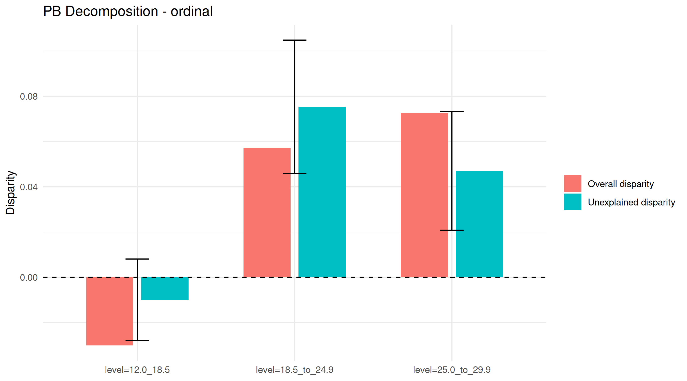
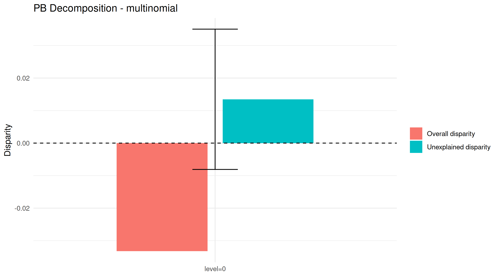
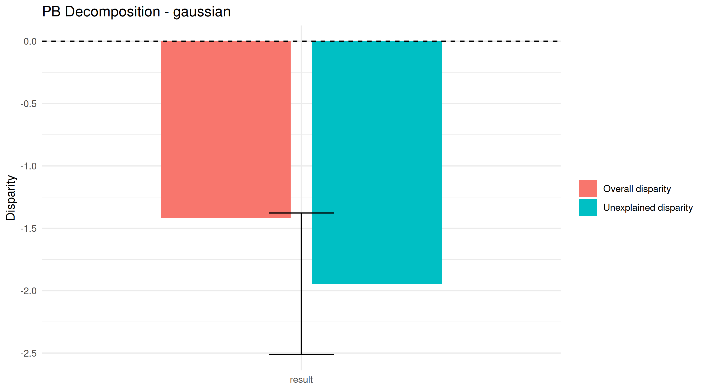

# pbanalysis
A package for implementing the Peters-Belson method for disparities research. Suitable for use with stratified multistage survey designs. 

## What is the Peters-Belson method
The Peters-Belson method is a technique for analyzing racial/gender/other disparities by determining what outcomes we would expect for members of a disadvantaged group, 
*had they been* members of the reference (advantaged) group. These expected outcomes are then compared with the observed outcomes for the disadvantaged group, to assess 
"explained disparity" by the covariates and "unexplained disparity" which is not addressed by the covaraites. To determine the expected outcomes, we first fit a model based only on data from members of the reference group. Then, using 
the reference group model, we predict the response for each member of the disadvantaged group using the covariates for that member. 

See https://www.ncbi.nlm.nih.gov/pmc/articles/PMC4630005/

## How to use this package
The `pbanalysis` package can be used to estimate the amount of unexplained disparity between a reference group and several disadvantaged groups (DG).

The package  implements PB-anlaysis for quantile regression model by Hong et al. (2022+).


Additionally, it can be used for PB-analyis for linear regression, logisitc regression (Li et al. xxx), and proprotional hazards models. To use this package, one must first call the `pb.fit` function, which is a constructor for an S3 object of class "pb". The `pb.fit` function takes several arguments, which 
are outlined in the manual for this package. There are several model families to choose from. These include linear regression (gaussian family), multinomial 
logistic regression (multinomial family), and (partial) proportional odds model (ordinal family). If the ordinal family is chosen, one has the option to specify an 
additional argument, `prop.odds.fail`, which is a list of covariates for which the proportional odds assumption may not necessarily hold. If this argument is left empty,
a regular proportional odds model is used. Otherwise, an unconstrained partial proportional odds model is used. Extension of the Taylor variance estimation procedure 
to the partial proportional odds model is based on original research by the package authors. 

The `pb.fit` function returns a `pb` object, which overrides the standard `plot` and `summary` methods. The `plot` method will create an array of graphical representations
which compare the disadvtanged group (DG)'s true mean, expected (i.e. counterfactual) mean, and the reference group mean. Note that in the case of ordinal or multinomial
families, estimates are shown for each level. The `summary` method gives a summary of the results of the pb analysis, including unexplained disparity and its approximate
variance. 

Below is an example usage, using the NHANES dataset: 
```
#load the data
data = data.frame(bmi_cat = NHANES::NHANESraw$BMI_WHO,
                  race = NHANES::NHANESraw$Race1,
                  age = NHANES::NHANESraw$Age,
                  poverty = NHANES::NHANESraw$Poverty,
                  weights = NHANES::NHANESraw$WTMEC2YR,
                  strata = NHANES::NHANESraw$SDMVSTRA,
                  psu = NHANES::NHANESraw$SDMVPSU
)
# drop missing values
data = na.omit(data)

#call the constructor
out = pb.fit(bmi_cat ~ age + poverty,
             data = data,
             weights = weights,
             strata = strata,
             psu = psu,
             disparity.group = "race",
             majority.group = "White",
             minority.group = c("Black"),
             prop.odds.fail = c("age"),
             family = "ordinal")

# visualize results
plot(out)

# display summary
summary(out)
```

## Example output plots

Running `R/examples/examples_2.R` now produces disparity decomposition charts and saves them in `images/`.

How to read these charts:
- Blue bar: observed disparity (`overall.disp`, White minus Black).
- Orange bar: unexplained disparity after adjustment (`unexplained.disp`).
- Black error bar: 95% confidence interval for unexplained disparity.
- Dashed horizontal line at 0: no disparity.
- Positive values indicate higher values/proportions for White; negative values indicate higher values/proportions for Black.

### Ordinal BMI category model
This figure shows category-specific decomposition for BMI categories (one bar pair per non-reference category probability).



### Binary BMI model (multinomial)
This figure shows decomposition for the binary BMI outcome (`level=0` in the script). In this run, raw and unexplained disparities point in opposite directions.



### Continuous BMI model (gaussian)
This figure shows decomposition for continuous BMI. In this run, the unexplained disparity is negative and the 95% CI is entirely below zero.


